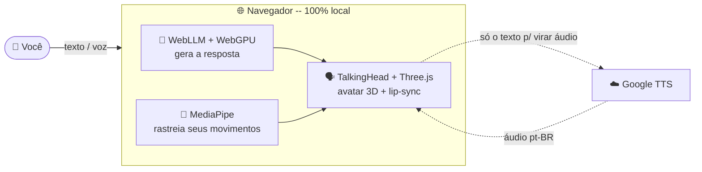

<div align="center">

# 🤖 Luiza AI


**Avatar 3D feminina que conversa em português (pt-BR) por texto e voz** — com sincronia labial por fonema e capaz de **imitar seus movimentos pela webcam**.
Tudo roda **100% no navegador**: a IA que gera as respostas baixa e executa localmente na sua máquina, então a conversa **nunca sai do seu computador**.

<br/>


</div>

---

## 🎬 Demonstração

<div align="center">

<!-- Grave a tela usando a Luiza, salve como docs/demo.gif e o GIF aparece aqui: -->


*Substitua por um GIF/vídeo real da aplicação em ação.*

</div>

> <details>
> <summary>📌 Como gravar o GIF de demo</summary>
>
> 1. Rode a app (`npm run dev`) e mostre: chat → voz da Luiza falando → botão "Copiar meus movimentos".
> 2. Grave a tela (no Windows: **Xbox Game Bar `Win+G`**; ou use o [ScreenToGif](https://www.screentogif.com/)).
> 3. Salve em `docs/demo.gif` (deixe abaixo de ~10 MB pra carregar rápido no GitHub).
> 4. Faça commit — o GIF aparece automaticamente aqui. ✨
>
> </details>

---

## ✨ Funcionalidades

| | Recurso | Descrição |
|---|---|---|
| 🧠 | **Chat com IA local** | Respostas em pt-BR por um LLM rodando no navegador via WebGPU — *keyless, gratuito e offline* depois do primeiro download. |
| 🗣️ | **Avatar 3D que fala** | A Luiza narra as respostas com voz pt-BR e **lip-sync por fonema**. |
| 🎙️ | **Reconhecimento de voz** | Fale sua mensagem (push-to-talk, Web Speech API). |
| 🕺 | **Copiar meus movimentos** | A avatar espelha cabeça, olhos, boca, braços e mãos capturados pela webcam (MediaPipe). |
| 🎨 | **Interface moderna** | UI responsiva com glassmorphism e feedback em tempo real. |

---

## 🏗️ Como funciona (arquitetura)

O grande diferencial: **quase tudo acontece dentro do navegador**. A única chamada externa é o TTS, só para transformar em áudio um texto que já apareceu na tela.



---

## 🧰 Stack

- **Frontend:** React 18 + Vite, Tailwind CSS, Zustand, TanStack Query
- **LLM (o "cérebro"):** [WebLLM](https://github.com/mlc-ai/web-llm) rodando `Llama-3.2-3B-Instruct` no navegador via WebGPU (Web Worker) — nenhuma chamada a servidor, nenhuma chave
- **Avatar 3D:** [TalkingHead](https://github.com/met4citizen/TalkingHead) sobre Three.js/WebGL, com modelos GLB do [Ready Player Me](https://readyplayer.me)
- **Voz (TTS):** Google Cloud Text-to-Speech (voz pt-BR)
- **Face/pose tracking:** MediaPipe Tasks Vision (Face / Pose / Hand Landmarker)
- **Reconhecimento de voz:** Web Speech API (SpeechRecognition)

---

## 🚀 Como rodar

```bash
cd frontend/reactjs-luiza-ai
cp .env.example .env.local   # preencha a chave do Google TTS
npm install
npm run dev                  # http://localhost:5173
```

> **Requisitos:** navegador com **WebGPU** (Chrome ou Edge atualizados) para o chat com IA.
> No primeiro uso, o modelo (~1,8 GB) é baixado e fica em cache.

<details>
<summary>⚙️ Variáveis de ambiente (<code>.env.local</code>)</summary>

<br/>

| Variável | Descrição |
| --- | --- |
| `VITE_TTS_ENDPOINT` | Endpoint do Google Cloud Text-to-Speech. |
| `VITE_TTS_API_KEY` | Chave do Google TTS (**nunca faça commit dela**; restrinja por domínio no Cloud Console). |
| `VITE_AVATAR_URL` | URL do `.glb` do avatar (padrão: modelo local). |
| `VITE_AVATAR_ID` | Alternativa: ID de um avatar Ready Player Me. |
| `VITE_AVATAR_BODY` | `F` (feminino) ou `M` (masculino). |

</details>

---

## 🔒 Privacidade

O texto das respostas é gerado **localmente** pelo WebLLM — nada é enviado a um servidor de IA. A única chamada externa é o Google TTS, usado apenas para converter em áudio o texto que já apareceu no chat.

---

<div align="center">

Feito com 💙 por **[Luiz Henrique](https://github.com/Luiz-henrique-lopes-viana)**

⭐ Se curtiu, deixa uma estrela no repositório!

</div>
